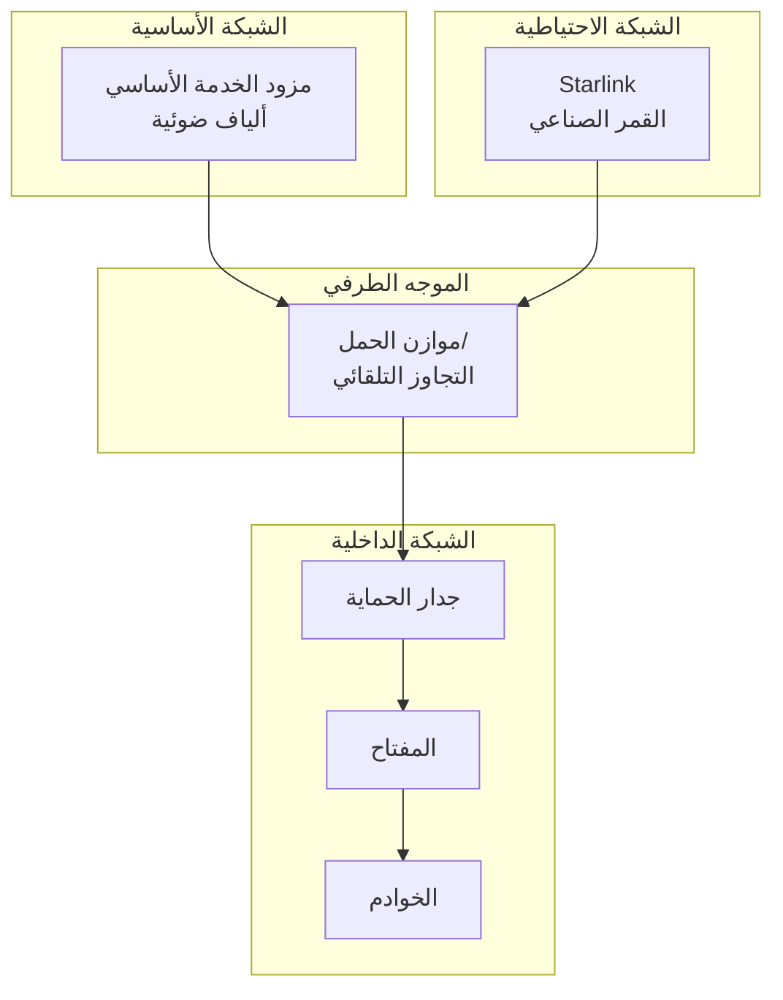

# شبكة Starlink الهجينة

## نظرة عامة

تُنفذ BrainSAIT بنية شبكة هجينة باستخدام اتصال Starlink الفضائي للتكرار والعمليات عن بُعد. يغطي هذا المستند التصميم والتكوين وحالات الاستخدام.

---

## البنية

### طوبولوجيا الشبكة



### المكونات

- **الأساسي:** اتصال ألياف ضوئية/مخصص
- **الاحتياطي:** طرفية Starlink
- **الموجه:** WAN مزدوج مع تجاوز تلقائي
- **جدار الحماية:** pfsense أو مشابه

---

## تكوين Starlink

### إعداد الأجهزة

**المعدات:**
- مجموعة Starlink القياسية
- محول PoE
- محول Ethernet
- معدات التركيب

**الموقع:**
- رؤية سماء صافية
- حد أدنى من العوائق
- حماية من الطقس
- توجيه الكابلات

### تكوين الشبكة

```bash
# Starlink يوفر DHCP
# التكوين النموذجي:
# IP: 192.168.1.x
# Gateway: 192.168.1.1
# DNS: Starlink أو مخصص
```

### IP ثابت (للأعمال)

للدخول المستقر:
- خطة Starlink للأعمال
- إضافة IP ثابت
- إعادة توجيه المنافذ متاحة

---

## تكوين التجاوز التلقائي

### إعداد pfsense

**مجموعات البوابات:**
```
الأساسي: ألياف ضوئية (الأولوية 1)
الاحتياطي: Starlink (الأولوية 2)
المُحفز: تعطل البوابة
```

**فحص الصحة:**
```
الهدف: 8.8.8.8
التردد: 5 ثوانٍ
العتبة: 3 إخفاقات
```

### بديل OPNsense

تكوين مشابه مع:
- مراقبة البوابة
- قواعد التجاوز
- فحوصات الصحة

---

## حالات الاستخدام

### استمرارية الأعمال

**السيناريو:** فشل مزود الخدمة الأساسي

**الحل:**
- تجاوز تلقائي
- وقت تعطل أدنى (<30 ثانية)
- الحفاظ على العمليات
- إشعارات التنبيه

### المواقع البعيدة

**السيناريو:** موقع بدون ألياف ضوئية

**الحل:**
- Starlink كأساسي
- احتياطي خلوي
- VPN للمكتب الرئيسي
- الحوسبة الطرفية

### العمليات المتنقلة

**السيناريو:** النشر المؤقت

**الحل:**
- Starlink محمول
- إعداد سريع
- اتصال كامل
- إدارة الطاقة

---

## خصائص الأداء

### المقاييس النموذجية

| المقياس | الألياف الضوئية | Starlink |
|---------|-----------------|----------|
| التنزيل | +100 Mbps | 50-200 Mbps |
| الرفع | +100 Mbps | 10-20 Mbps |
| زمن الوصول | 5-20 ms | 25-60 ms |
| التذبذب | منخفض | معتدل |

### ملاءمة التطبيقات

| التطبيق | الألياف الضوئية | Starlink |
|---------|-----------------|----------|
| تصفح الويب | ممتاز | ممتاز |
| استدعاءات API | ممتاز | جيد |
| مكالمات الفيديو | ممتاز | جيد |
| نقل الملفات | ممتاز | جيد |
| الألعاب الفورية | ممتاز | معتدل |
| VoIP | ممتاز | جيد |

---

## اعتبارات الأمان

### تكوين VPN

```bash
# ضمان VPN عبر Starlink
# النظر في تقسيم النفق
# مراقبة تغييرات IP
```

### قواعد جدار الحماية

- نفس قواعد الأساسي
- حظر الوارد افتراضياً
- السماح بحركة VPN
- مراقبة النشاط غير المعتاد

### التشفير

- استخدام HTTPS دائماً
- VPN للحركة الحساسة
- DNS مشفر
- التحقق من الشهادات

---

## المراقبة

### مراقبة الشبكة

**المقاييس للتتبع:**
- استخدام النطاق الترددي
- اتجاهات زمن الوصول
- فقدان الحزم
- أحداث التجاوز

**الأدوات:**
- Prometheus + Grafana
- Smokeping
- PRTG
- LibreNMS

### التنبيه

```yaml
alerts:
  - name: تعطل مزود الخدمة الأساسي
    condition: gateway_status != "up"
    notify: ops-team

  - name: زمن وصول عالٍ
    condition: latency > 100ms
    notify: network-team

  - name: التجاوز نشط
    condition: active_gateway == "starlink"
    notify: ops-team
```

---

## إدارة التكاليف

### تكاليف Starlink

| العنصر | التكلفة |
|--------|---------|
| الأجهزة | ~2,000 ريال سعودي |
| شهرياً (سكني) | ~400 ريال سعودي |
| شهرياً (أعمال) | ~600 ريال سعودي |
| IP ثابت | +200 ريال سعودي |

### التحسين

- الاستخدام كاحتياطي فقط
- مراقبة استخدام البيانات
- النظر في خطة الأعمال
- تقييم البدائل

---

## استكشاف الأخطاء وإصلاحها

### المشكلات الشائعة

| المشكلة | الحل |
|---------|------|
| سرعات بطيئة | التحقق من العوائق |
| زمن وصول عالٍ | طبيعي للقمر الصناعي |
| انقطاعات | التحقق من توصيلات الكابل |
| لا يوجد IP | إعادة تشغيل موجه Starlink |
| تحديثات البرامج الثابتة | السماح بالتحديثات التلقائية |

### أوامر التشخيص

```bash
# التحقق من حالة البوابة
ping -c 5 192.168.1.1

# اختبار الاتصال الخارجي
ping -c 5 8.8.8.8

# التحقق من المسار
traceroute google.com

# اختبار السرعة
speedtest-cli
```

---

## أفضل الممارسات

### التصميم

1. بنية أساسي + احتياطي
2. التجاوز التلقائي
3. الاختبار المنتظم
4. التوثيق

### العمليات

1. مراقبة كلا الرابطين
2. اختبار التجاوز شهرياً
3. تحديث البرامج الثابتة
4. مراجعة السجلات

### الأمان

1. نفس سياسات الأمان
2. VPN عند الحاجة
3. مراقبة الشذوذات
4. تحديث التكوينات

---

## المستندات ذات الصلة

- [Cloudflare](cloudflare.ar.md)
- [الأمان](security.ar.md)
- [مجموعة Raspberry](raspberry_cluster.ar.md)
- [CI/CD](../devops/cicd.ar.md)

---

*آخر تحديث: يناير 2025*
