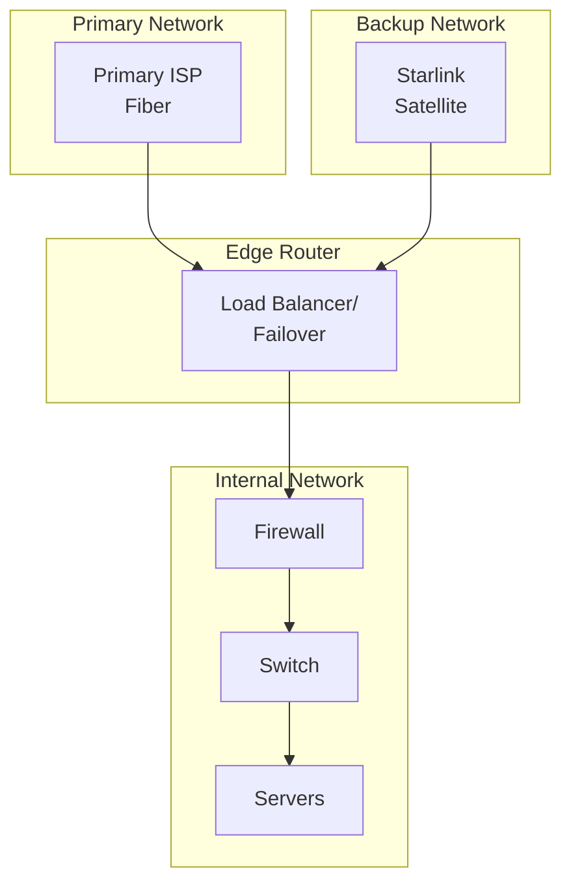

# Starlink Hybrid Network

## Overview

BrainSAIT implements a hybrid network architecture using Starlink satellite connectivity for redundancy and remote operations. This document covers the design, configuration, and use cases.

---

## Architecture

### Network Topology



### Components

- **Primary:** Fiber/dedicated connection
- **Backup:** Starlink terminal
- **Router:** Dual-WAN with failover
- **Firewall:** pfsense or similar

---

## Starlink Configuration

### Hardware Setup

**Equipment:**
- Starlink Standard kit
- PoE adapter
- Ethernet adapter
- Mounting hardware

**Location:**
- Clear sky view
- Minimal obstructions
- Weather protection
- Cable routing

### Network Configuration

```bash
# Starlink provides DHCP
# Typical configuration:
# IP: 192.168.1.x
# Gateway: 192.168.1.1
# DNS: Starlink or custom
```

### Static IP (Business)

For stable ingress:
- Starlink Business plan
- Static IP add-on
- Port forwarding available

---

## Failover Configuration

### pfsense Setup

**Gateway Groups:**
```
Primary: Fiber (Priority 1)
Backup: Starlink (Priority 2)
Trigger: Gateway down
```

**Health Check:**
```
Target: 8.8.8.8
Frequency: 5 seconds
Threshold: 3 failures
```

### OPNsense Alternative

Similar configuration with:
- Gateway monitoring
- Failover rules
- Health checks

---

## Use Cases

### Business Continuity

**Scenario:** Primary ISP failure

**Solution:**
- Automatic failover
- Minimal downtime (<30 sec)
- Maintained operations
- Alert notifications

### Remote Sites

**Scenario:** Location without fiber

**Solution:**
- Starlink as primary
- Cellular backup
- VPN to main office
- Edge computing

### Mobile Operations

**Scenario:** Temporary deployments

**Solution:**
- Portable Starlink
- Quick setup
- Full connectivity
- Power management

---

## Performance Characteristics

### Typical Metrics

| Metric | Fiber | Starlink |
|--------|-------|----------|
| Download | 100+ Mbps | 50-200 Mbps |
| Upload | 100+ Mbps | 10-20 Mbps |
| Latency | 5-20 ms | 25-60 ms |
| Jitter | Low | Moderate |

### Application Suitability

| Application | Fiber | Starlink |
|-------------|-------|----------|
| Web browsing | Excellent | Excellent |
| API calls | Excellent | Good |
| Video calls | Excellent | Good |
| File transfer | Excellent | Good |
| Real-time gaming | Excellent | Moderate |
| VoIP | Excellent | Good |

---

## Security Considerations

### VPN Configuration

```bash
# Ensure VPN over Starlink
# Consider split tunneling
# Monitor for IP changes
```

### Firewall Rules

- Same rules as primary
- Block incoming by default
- Allow VPN traffic
- Monitor unusual activity

### Encryption

- Always use HTTPS
- VPN for sensitive traffic
- Encrypted DNS
- Certificate validation

---

## Monitoring

### Network Monitoring

**Metrics to Track:**
- Bandwidth usage
- Latency trends
- Packet loss
- Failover events

**Tools:**
- Prometheus + Grafana
- Smokeping
- PRTG
- LibreNMS

### Alerting

```yaml
alerts:
  - name: Primary ISP Down
    condition: gateway_status != "up"
    notify: ops-team

  - name: High Latency
    condition: latency > 100ms
    notify: network-team

  - name: Failover Active
    condition: active_gateway == "starlink"
    notify: ops-team
```

---

## Cost Management

### Starlink Costs

| Item | Cost |
|------|------|
| Hardware | ~2,000 SAR |
| Monthly (Residential) | ~400 SAR |
| Monthly (Business) | ~600 SAR |
| Static IP | +200 SAR |

### Optimization

- Use as backup only
- Monitor data usage
- Consider business plan
- Evaluate alternatives

---

## Troubleshooting

### Common Issues

| Issue | Solution |
|-------|----------|
| Slow speeds | Check obstructions |
| High latency | Normal for satellite |
| Disconnections | Check cable connections |
| No IP | Restart Starlink router |
| Firmware updates | Allow automatic updates |

### Diagnostic Commands

```bash
# Check gateway status
ping -c 5 192.168.1.1

# Test external connectivity
ping -c 5 8.8.8.8

# Check route
traceroute google.com

# Speed test
speedtest-cli
```

---

## Best Practices

### Design

1. Primary + backup architecture
2. Automatic failover
3. Regular testing
4. Documentation

### Operations

1. Monitor both links
2. Test failover monthly
3. Update firmware
4. Review logs

### Security

1. Same security policies
2. VPN when needed
3. Monitor for anomalies
4. Update configurations

---

## Related Documents

- [Cloudflare](cloudflare.md)
- [Security](security.md)
- [Raspberry Cluster](raspberry_cluster.md)
- [CI/CD](../devops/cicd.md)

---

*Last updated: January 2025*
